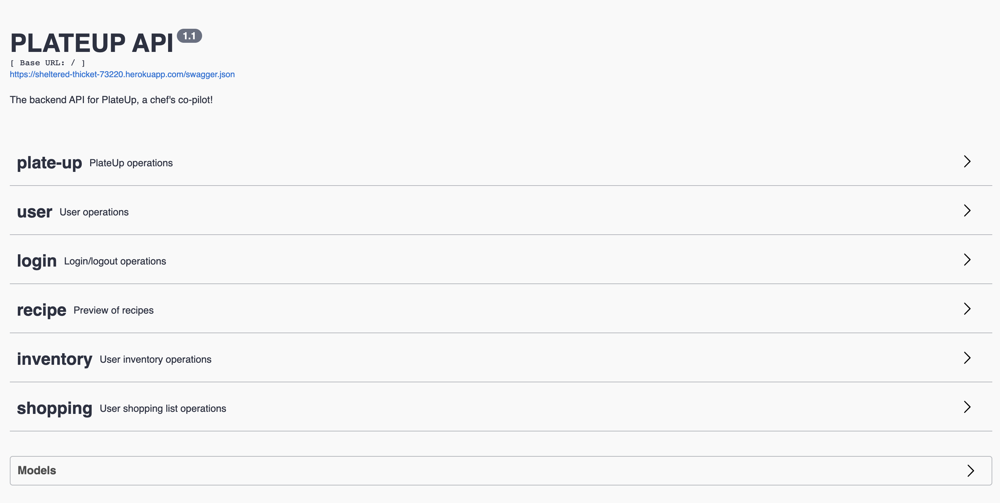

# PlateUp API Service

Hello! Welcome to PlateUp's API service submodule.

###### Main Repo: https://github.com/ECE444-2020Fall/project1-plateup-group5-pyromaniacs

###### Heroku API service (staging): https://sheltered-thicket-73220.herokuapp.com/

This is a submodule of the PlateUp main repo, all development instructions are available in the main repo. This submodule was created near beta release to facilitate heroku staging deployment, and to better track issues and update documentation. 

 
## OpenAPI (formerly swagger) documentation overview 

API spec base url: https://sheltered-thicket-73220.herokuapp.com/swagger.json

## This API currently offers the following features (updated Nov 12 2020):

### User Account Creation, Retrieval, and Deletion
The following shows a sample flow of the user account creation process as seen from the backend service's perspective. A welcome email is sent to the user after successful account creation. This is mostly for development purposes at the moment, such as retrieving the user-id, but the email could be improved in the future to be user-friendly.
 

 
### User Login
Logging in after account creation is as simple as inputting the user's email and password, just like most mobile apps.
 

Most APIs are restricted to logged-in users for security reasons. If the user doesn't have an active session with the API service, they will be forbidden from issuing requests to most endpoints. Here, we test it with the default route.
 

### Recipe Retrieval
After a new user registers and logs in, they can immediately search recipes. By default, the route will return a randomized list of the most popular recipes. Popularity is based on the "popular" tag from the Spoonacular source, but future plans include tracking the number of users who cooked each recipe.
 

 
Of course, all the search and filtering functionality is also supported. Here is an example of searching for chicken. Through the backend, the returned json is a bit difficult to read (hence the mobile app experience is necessary), but still possible to see that the search functions as expected.
 

 
 
### Inventory, Shopping List, and Recipes based on Inventory Checking
The original intent of the app was the recommend recipes based on available ingredients, and this is fully supported through applying filters. More interestingly, we also support automating the process of checking whether or not the user has all the ingredients for a recipe if they choose to go ahead with cooking it (rather than just searching for recipes). To make this more clear, the following are the demos.

Once a user selects a recipe, they can copy the recipe ID and their user ID and issue a GET request at the recipe checker endpoint. Keep in mind that for this backend service, the "user" in this case is the frontend mobile client, so all this "id copying" is abstracted away on the frontend.
 

 
 
If the user doesn't have enough ingredients, the missing ingredients are automatically sent to the user's shopping list, so that they can buy it on their next grocery trip. Of course, this demonstrates the GET request to see the updated shopping list with ingredients required by the recipe (since this was a new user, their inventory and shopping list were both empty). The user can also manually add items to either their inventory or shopping list through POST, not shown here.

 
 
After the user's grocery trip, there is a /flash endpoint for shopping list that pushes their list items to their inventory without having to manually manage it. For now, the flash will push all the shopping list items, but it is possible to expand this to support partial transfers in the future (user can select which items they bought and update the partial list to inventory). After flashing, we can see that the user's inventory is now populated with the ingredients from the shopping list. The shopping list is now empty. 
 

 
 
Finally, now that the user has all the ingredients, they can once again use the recipe checker to cook the specified recipe. Now, the service will deduct all the appropriate ingredients from their inventory. This gif shows the cleared inventory after the user cooks the recipe, which was the initial state before all these steps.
 

 
 
 
To summarize, we just showed through entirely backend calls a user's journey as they are onboarded, logged in, searched for a recipe, tried to cook a recipe and not have enough ingredients, used the shopping list to acquire the ingredients, pushing the purchased ingredients to their inventory, cooking the recipe with ingredients from the inventory, and finally they once again have a clear inventory as those ingredients were deducted.
 

## Why use OpenAPI spec and swagger documentation?
OpenAPI is the group's choice for a backend to frontend hand-off tool, but also follows an industry standard for development against APIs. Due to PlateUp's achitecture as a server-client application, the functionality of backend services must be testable separately from the frontend application. As such, OpenAPI documentation allows us to excessively document all our endpoints and routes, as well as test it as shown in the gifs above. Coupled with our unit tests, this form of integration testing really ensures good application quality. 

One further example of the documentation that OpenAPI offers is defining models (the request/response structures) clearly for front-end devs:

 
                                                                                                                           
  
## Future Improvements
There is still a lot of work to be done on the backend service. Some are feature focused, such as expanding shopping/flash functionality, adding the ability to get and delete individual users rather than clearing all users, etc. Others are bug focused, such as supporting multiple consecutive recipe checks without adding ingredients to a user's shopping list multiple times. Still, others include potentially open-sourcing this API, because it is written in clear, well-documented code and uses the OpenAPI standard, which allows it to become a public-facing API (other versions of PlateUp or Chef's CoPilot can develop against it) without too much effort. For all of these goals, more development effort and time is required.
